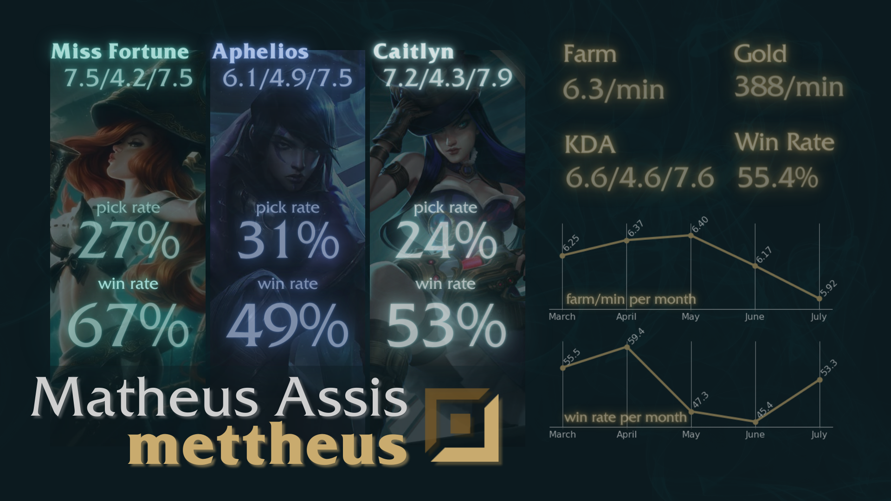

# League of Legends - Ranked Analysis

### Dashboard Results

## Medium Story about the creation of this project
[**Medium**](#)

## About
First of all, I uninstalled League of Legends yesterday due to some stress playing the game. If you play, you probably understand what I'm talking about.

Trying to become more confortable on showing data, I created this project scrapping data from League of Legends matches history on their own website. After, I used my finished ranked games as an ADC to achieve the results on the dashboard created. Having more than 200 games this season, the results made it clear to me what were the problems.

* [**league_preprocessing.ipynb**](https://github.com/MatheusMAssis/League-of-Legends-Analysis/blob/master/league_preprocessing.ipynb) is the file where I created the main csv file. I used Beautiful Soup to read my html file with all the games I wanted displayed on the page.
* [**league_analysis.ipynb**](https://github.com/MatheusMAssis/League-of-Legends-Analysis/blob/master/league_analysis.ipynb) is the file where I generated the results that are displayed on my dashboard. Also, it's the main file for understanding my approach to achieve results using this database.

## Conclusions
My stress came through an excessive streak of losses when I couldn't do anything in the game. That happened mostly because I was unable to maintain my farm at high levels as the months passed by. If you don't know about League of Legends, farm is the main way to earn gold throughout the match. Also, as an ADC, I need to have items to become strong and carry the game, so I need to earn as much gold as I can.

One important thing to notice is that I went from Bronze to Gold, so that can justify my loss of farm and wins in the early months. In addition, I was playing a lot more than usual, and that probably made me perform bad due to excess of playing.

For the champions analysis, I chose my Top 3 picks and made their own analysis. I still love Aphelios, even though I'm not that good with him... Maybe that's another reason for my bad performance.

## Built With
* [Python](https://www.python.org/) - Programming Language used.
* [Jupyter Notebook](https://jupyter.org/) - IDE used.
* [League of Legends Match History](https://matchhistory.eune.leagueoflegends.com/en/#match-history/BR1/2067186412415168) - Data Base used. 
* [Beautiful Soup](https://www.crummy.com/software/BeautifulSoup/bs4/doc/) - Used to read html file.
* [Canva](https://www.canva.com/) - Platform to create the dashboard.

## Authors
* **Matheus Assis** - [GitHub](https://github.com/MatheusMAssis)

## License
This project is licensed under the MIT License - see the [LICENSE.md](LICENSE.md) file for details.

## Thanks

Thanks for visiting my GitHub! <3
